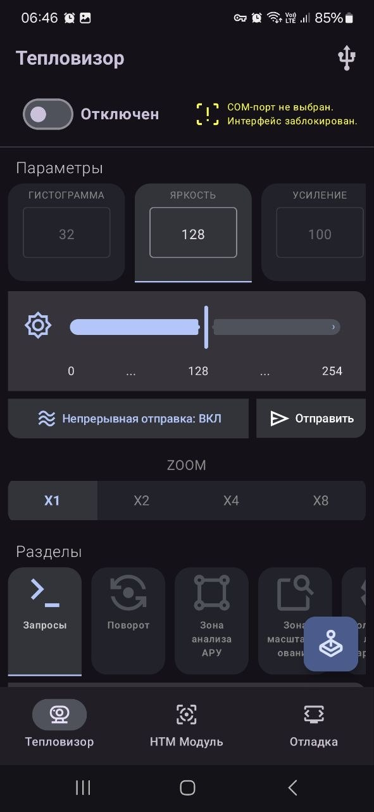
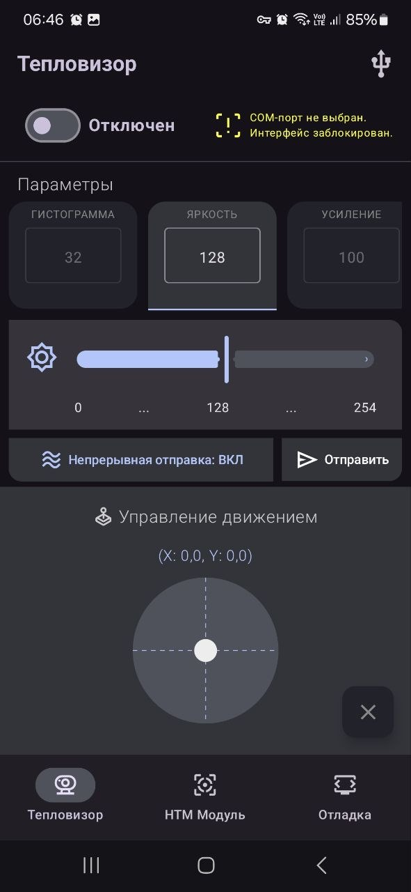
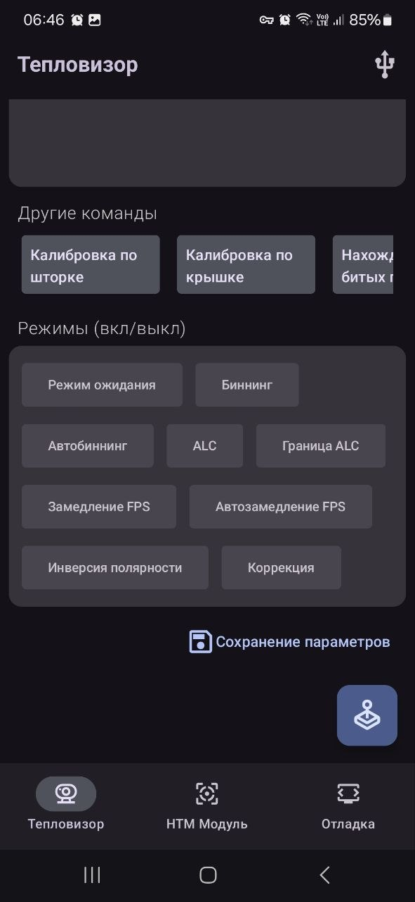
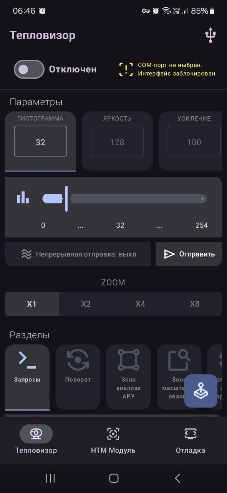
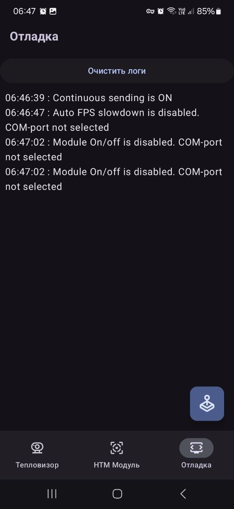

# Приложение для управления тепловизором и НТМ модулем
  Приложение через USB подключается к двум разным COM-портам изготовленного устройства 
  для попеременной отправки команд по управлению движением (через джойстик) подвеса тепловизора
  и отправки команд и переключением режимом работы. 

  Протокол отправки команд - VISCA.
  > С помощью протокола VISCA можно обеспечить полное управление функциями камеры, например, такими как, наклон, поворот, масштабирование, увеличение/уменьшение фокусного расстояния и т.п.
  

## Тепловизор
  #### Приложение, не подключенное к устройству выглядит в данный момент следующим образом:
  

    
    
    
    
    
  

  
